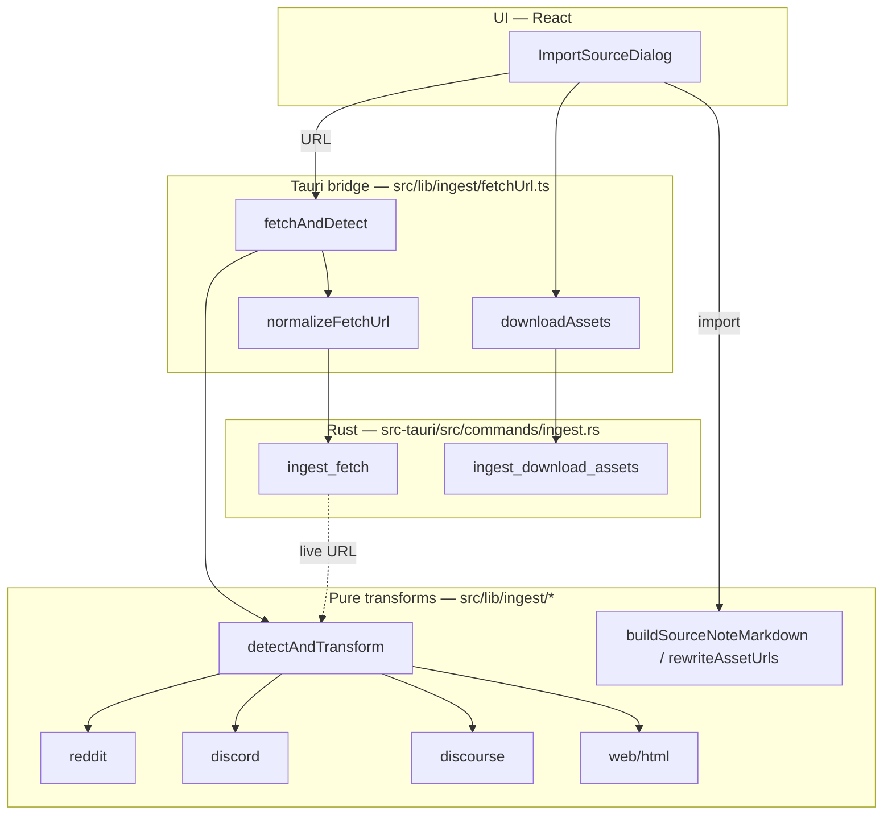

# Archival Ingest — Source Notes

Grover can archive external content — Reddit threads, Discord channels, forum
topics, and web articles — as ordinary typed notes that live in your vault and
read back **fully offline**. Nothing becomes a proprietary object: every import
is a Markdown note with provenance frontmatter, so it flows through the typed
graph, query engine, vault health, and AI exactly like any note you write.

> Design rationale and alternatives are recorded in
> [`docs/adr/0138-local-archival-ingest.md`](./adr/0138-local-archival-ingest.md).
> Structural summaries live in [`ARCHITECTURE.md`](./ARCHITECTURE.md) (Tauri
> commands) and [`ABSTRACTIONS.md`](./ABSTRACTIONS.md) (the `SourceNote` model).

---

## Using it

Open the command palette and run **Import source** (also grouped under
*Insights*). The dialog offers two paths:

1. **Fetch a URL** — paste a public link (a Reddit thread, a Discourse forum
   topic, or any article) and click **Fetch**. Grover fetches it natively
   (see [why a native fetch](#why-fetching-happens-in-rust)), detects the
   format, and shows a preview.
2. **Paste content** — paste exported JSON or raw HTML directly. This is the
   path for sources with no anonymous read API (notably **Discord**, via a
   [DiscordChatExporter](https://github.com/Tyrrrz/DiscordChatExporter) JSON
   export).

The preview shows the detected type, title, asset count, and line count. Click
**Import note** to write it into the vault.

Imported notes land in **`Sources/`** as `‹source›-‹slug›.md`, and any images or
files they reference are downloaded into **`Sources/_assets/‹slug›/`** so the
archive stays readable with no network.

---

## Supported sources

| Source | Detected from | Input you provide | Note `type` |
|---|---|---|---|
| **Reddit** | a 2-element JSON array `[post, comments]` | the thread URL (auto-suffixed `.json`) or pasted `.json` | `Reddit Thread` |
| **Discord** | a JSON object with `messages[]` | a DiscordChatExporter JSON export (paste) | `Discord Channel` |
| **Discourse** | a JSON object with `post_stream.posts` | the topic URL (auto-suffixed `.json`) or pasted JSON | `Forum Post` |
| **Web** | raw HTML that isn't valid JSON | an article URL or pasted HTML | `Web Clip` |

Detection is heuristic and pure — see `detectAndTransform` in
`src/lib/ingest/index.ts`.

### Per-source notes

- **Reddit** — comment `body` is already Markdown, so the comment tree is a
  structural transform (nested by depth, `more` placeholders skipped). Images
  are embedded inline so they render and localize: a direct image post, a
  **gallery** (`gallery_data` → `media_metadata`), or the **preview** image.
  Reddit HTML-escapes `&` in media URLs (`&amp;`); these are un-escaped.
- **Discord** — rendered as `author · time` headers with quoted message lines.
  Image attachments embed inline; other attachments (pdf, zip, …) become links.
  All attachments are downloaded for offline use.
- **Discourse** — each post's `cooked` HTML is converted to Markdown; the first
  poster becomes the note `author`.
- **Web** — a light readability pass prefers `<article>`/`<main>` and strips
  `nav`/`header`/`footer`/`aside`, so the clip is the article, not the whole
  page. Title comes from `<title>` then `<h1>`.

---

## Frontmatter (provenance)

```yaml
---
title: How do you organize notes?
type: Reddit Thread
source: reddit
url: https://www.reddit.com/r/PKM/comments/abc/how_do_you/
author: alice
captured_at: 2026-06-28T12:34:56.000Z
---
```

`url` and `author` are omitted when unknown. Title/url/author are quoted when
they would otherwise parse as a non-string YAML scalar (`No`, `123`, `null`, …).

---

## Offline assets

On import, referenced asset URLs are downloaded into `Sources/_assets/‹slug›/`
and the note body is rewritten to point at the local copies, so images and files
survive offline and after the remote deletes them.

- Filenames are derived from the URL's last path segment, sanitized (no path
  traversal), and **de-duplicated** so two assets that share a basename don't
  clobber each other.
- The download result is **index-aligned** with the input URLs (an empty slot
  marks a skipped/failed asset); a single broken image never fails the import.
  Failed assets keep their original remote URL in the note.

---

## Architecture

Three layers, kept deliberately separate so the transforms stay pure and
unit-testable with no Tauri or network dependency.



### File map

| Path | Responsibility |
|---|---|
| `src/lib/ingest/source.ts` | `SourceNote` model, slug, frontmatter serialization |
| `src/lib/ingest/reddit.ts` | Reddit thread `.json` → `SourceNote` (+ media) |
| `src/lib/ingest/discord.ts` | DiscordChatExporter export → `SourceNote` |
| `src/lib/ingest/discourse.ts` | Discourse topic JSON → `SourceNote` |
| `src/lib/ingest/web.ts` | HTML web clip → `SourceNote` (readability) |
| `src/lib/ingest/html.ts` | Minimal HTML → Markdown (DOMParser) |
| `src/lib/ingest/assets.ts` | `rewriteAssetUrls` (remote → local paths) |
| `src/lib/ingest/index.ts` | barrel + `detectAndTransform` |
| `src/lib/ingest/fetchUrl.ts` | Tauri bridge: `fetchAndDetect`, `downloadAssets`, `normalizeFetchUrl` |
| `src/components/ImportSourceDialog.tsx` | the UI |
| `src-tauri/src/commands/ingest.rs` | `ingest_fetch`, `ingest_download_assets` |

### Rust commands

```rust
// Fetch a public http(s) URL's body as text (descriptive User-Agent).
async fn ingest_fetch(url: String, user_agent: Option<String>) -> Result<String, String>

// Download asset URLs into <vault>/<dest_dir>; returns saved filenames
// index-aligned with `urls` (empty string = skipped/failed).
async fn ingest_download_assets(
    vault_path: String, dest_dir: String,
    urls: Vec<String>, user_agent: Option<String>,
) -> Result<Vec<String>, String>
```

#### Why fetching happens in Rust

Browser `fetch` is blocked by CORS for these third-party endpoints, and Reddit
and several forums reject the default `reqwest` user-agent. The Rust layer sends
a descriptive `GroverNotes/‹version›` agent, validates the scheme (http/https
only — no `file://`), and runs the blocking request off the async runtime.

---

## Extending it — adding a new source

1. Add a `SourceKind` and `TYPE_LABEL` entry in `source.ts`.
2. Write a pure `‹source›ToSourceNote(payload) → SourceNote` transform (+ test).
3. Teach `detectAndTransform` (and, if URL-fetchable, `normalizeFetchUrl`) to
   recognize it.
4. Re-use `htmlToMarkdown` for HTML-bearing formats and embed image URLs in the
   body so the asset pipeline localizes them.

Keep transforms pure (no Tauri/network) so they unit-test in jsdom.

---

## Testing

```bash
# Pure transforms + bridge + dialog (jsdom)
npx vitest run src/lib/ingest src/components/ImportSourceDialog.test.tsx

# Rust commands (real fetch/download via an in-process HTTP server)
cargo test --manifest-path src-tauri/Cargo.toml --lib commands::ingest
```

Coverage spans the transforms, URL normalization, asset collision/alignment,
the dialog states, and the Rust fetch/download/404/invalid-scheme paths.

---

## Known limitations & future work

- **Offline-only sources require an export.** Discord has no anonymous read API,
  so it's import-by-export (DiscordChatExporter JSON). Live Discord (bot/OAuth)
  is future work.
- **No size cap** on downloads — fine for a desktop archival tool, would matter
  server-side.
- **Heuristic detection.** An arbitrary JSON array is treated as a Reddit
  payload; unusual shapes degrade to a near-empty note rather than erroring.
- **Not yet built** (from the original request): ZIM/Kiwix reader, in-app
  PDF/video viewers with text extraction. These need native viewer QA.
- **Localization.** Dialog strings are currently English-only; they should move
  to `src/lib/locales/en.json` and run through `pnpm l10n:translate`.
